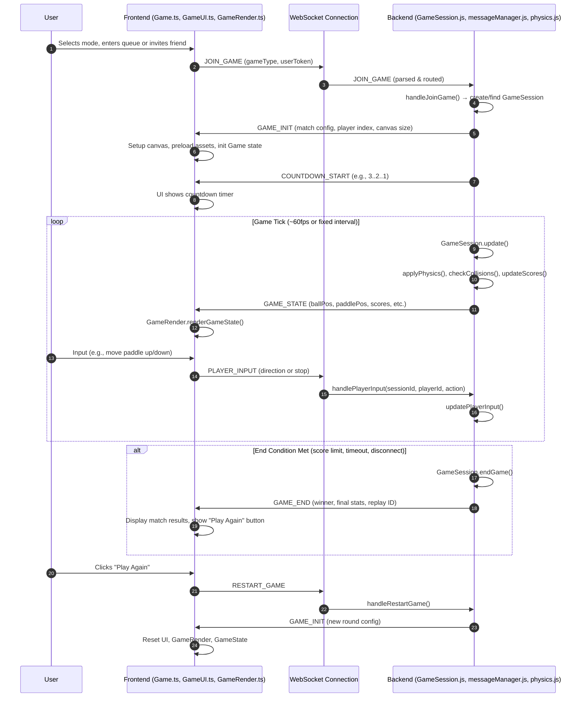

# Front - Back GameLogic

# 🎮 Game Frontend-Backend Workflow

### 🧠 Key Files:
`Game.ts` Manages core game loop and ties input/rendering to WebSocket messages.
`GameRender.ts` Draws current state based on GAME_STATE payloads.
`GameUI.ts` Manages overlay elements (scoreboard, countdown, end screen).
`messageManager.js` Routes incoming WebSocket messages to proper handlers.
`GameSession.js` Central authority for game state, physics, timing, etc.
`physics.js` Ball and paddle movement, collisions, wall/goal detection.
`eventManager.js` Optional decoupling layer for triggering logs or metrics.

# 📈 Sequence Diagram (Rendered)

# Step by Step Workflow

### 1. 🎮 Game Setup & Initialization

1. **User selects a game mode** (e.g., ranked, casual, invite).
2. The **frontend** sends a `JOIN_GAME` request to the **backend** via WebSocket.
3. The **backend** handles the request using `messageManager.js`, creates or finds a `GameSession`, and stores the user and game configuration.
4. The backend responds with a `GAME_INIT` message containing:
   - Match configuration
   - Player index (e.g., Player 1 or 2)
   - Canvas/game size
5. The **frontend** sets up:
   - The game canvas
   - The UI
   - Initializes rendering and internal state

---

### 2. ⏳ Countdown Phase (Optional)

1. The backend sends a `COUNTDOWN_START` message (e.g., 3..2..1).
2. The frontend displays the countdown using the UI.

---

### 3. 🔁 Main Game Loop

This loop runs until a win condition is met (e.g., score limit or timeout).

**On the Backend:**

- The backend updates game state in `GameSession.js` at fixed intervals (~60 times/sec):
  - Ball movement and position
  - Paddle collisions
  - Goal detection and scoring
- The new game state is broadcast to all connected players via `GAME_STATE`.

**On the Frontend:**

- The frontend receives the latest `GAME_STATE` and renders it using `GameRender.js`.
- The user provides input via keyboard or controller.
- Input is handled by `GameControllers.js` and sent to the backend as `PLAYER_INPUT`.
- The backend receives this input and updates the player’s paddle position for the next tick.

---

### 4. 🏁 Game End

When a game-ending condition is met:

1. The backend calls `endGame()` in `GameSession.js`.
2. It sends a `GAME_END` message to the frontend with:
   - Winner and loser info
   - Final score
   - Optionally, a replay ID or game stats
3. The frontend UI shows the game results using `GameUI.ts`.

---

### 5. 🔁 Restart Game (Optional)

1. The user clicks **"Play Again"**.
2. The frontend sends a `RESTART_GAME` message via WebSocket.
3. The backend resets or re-initializes the same `GameSession` or creates a new one.
4. A new `GAME_INIT` is sent, and the UI resets to start a new match.

---

### 📡 Summary of WebSocket Message Flow

| Direction        | Message Type     | Description                          |
|------------------|------------------|--------------------------------------|
| Frontend → Backend | `JOIN_GAME`      | Player attempts to join a game       |
| Frontend → Backend | `PLAYER_INPUT`   | Paddle movement                      |
| Backend → Frontend | `GAME_INIT`      | Match settings and player assignment |
| Backend → Frontend | `GAME_STATE`     | Live game state updates              |
| Backend → Frontend | `GAME_END`       | Final result of the match            |
| Frontend → Backend | `RESTART_GAME`   | Start another match                  |

---

### 📁 File Roles Overview

**Frontend Files**
- `Game.ts`: Game loop and logic integration
- `GameRender.ts`: Canvas rendering logic
- `GameControllers.ts`: Keyboard/controller input
- `GameUI.ts`: UI overlays like scores, countdown, end screen
- `GameConnection.ts`: WebSocket client

**Backend Files**
- `GameSession.js`: Main game session state and update loop
- `messageManager.js`: Handles incoming messages
- `physics.js`: Ball/paddle collision and movement
- `gameLogs.js`: Logs game outcomes
- `eventManager.js`: Broadcasts or reacts to game events

---